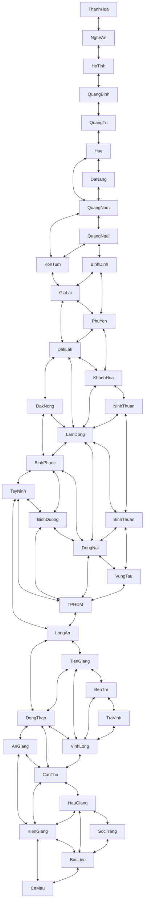

# BẢN ĐỒ 

```mermaid
graph

ThanhHoa <--> NgheAn
NgheAn <--> HaTinh
HaTinh <--> QuangBinh
QuangBinh <--> QuangTri
QuangTri <--> Hue
Hue <--> QuangNam
DaNang <--> QuangNam
Hue <--> DaNang


QuangNam <--> KonTum
QuangNam <--> QuangNgai 
QuangNgai <--> KonTum
QuangNgai <--> BinhDinh
BinhDinh <--> GiaLai
BinhDinh <--> PhuYen
KonTum <--> GiaLai
GiaLai <--> DakLak
GiaLai <--> PhuYen
PhuYen <--> DakLak
PhuYen <--> KhanhHoa
KhanhHoa <--> LamDong
KhanhHoa <--> NinhThuan

NinhThuan <--> LamDong
NinhThuan <--> BinhThuan


DakLak <--> DakNong
DakLak <--> LamDong
DakLak <--> KhanhHoa
DakNong <--> BinhPhuoc
DakNong <--> LamDong
LamDong <--> BinhPhuoc
LamDong <--> DongNai
LamDong <--> BinhThuan
BinhThuan <--> DongNai
BinhThuan <--> VungTau
TayNinh <--> LongAn
TPHCM <--> LongAn
TayNinh <--> TPHCM
BinhDuong <--> TPHCM
DongNai <--> TPHCM
VungTau <--> TPHCM
TayNinh <--> BinhDuong
BinhDuong <--> DongNai
DongNai <--> VungTau
BinhPhuoc <--> TayNinh
BinhPhuoc <--> BinhDuong
BinhPhuoc <--> DongNai
LongAn <--> DongThap
LongAn <--> TienGiang
TienGiang <--> DongThap
TienGiang <--> VinhLong
TienGiang <--> BenTre
DongThap <--> AnGiang
DongThap <--> CanTho
DongThap <--> VinhLong
BenTre <--> VinhLong
BenTre <--> TraVinh
TraVinh <--> VinhLong
VinhLong <--> CanTho
AnGiang <--> KienGiang
AnGiang <--> CanTho
CanTho <--> KienGiang
CanTho <--> HauGiang
HauGiang <--> KienGiang
HauGiang <--> BacLieu
HauGiang <--> SocTrang
KienGiang <--> CaMau
KienGiang <--> BacLieu
SocTrang <--> BacLieu
BacLieu <--> CaMau
```