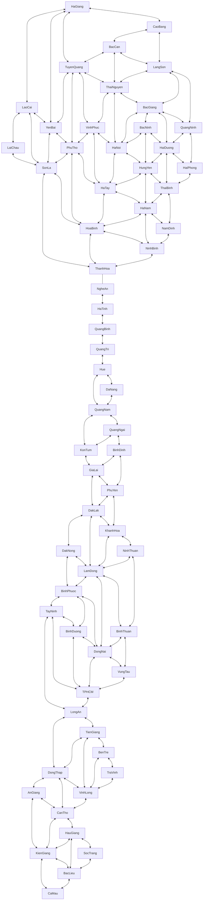

# BẢN ĐỒ 

```mermaid
graph


HaGiang <--> LaoCai
HaGiang <--> YenBai
HaGiang <--> TuyenQuang
HaGiang <--> CaoBang
CaoBang <--> BacCan
CaoBang <--> LangSon
BacCan <--> TuyenQuang
BacCan <--> ThaiNguyen
BacCan <--> LangSon
LangSon <--> ThaiNguyen
LangSon <--> BacGiang
LangSon <--> QuangNinh
QuangNinh <--> HaiDuong
QuangNinh <--> HaiPhong
TuyenQuang <--> YenBai
TuyenQuang <--> PhuTho
TuyenQuang <--> VinhPhuc
TuyenQuang <--> ThaiNguyen
ThaiNguyen <--> VinhPhuc
ThaiNguyen <--> HaNoi
ThaiNguyen <--> BacGiang
BacGiang <--> HaNoi
BacGiang <--> BacNinh
BacGiang <--> HaiDuong
BacGiang <--> QuangNinh
BacNinh <--> HaNoi
BacNinh <--> HungYen
BacNinh <--> HaiDuong
HaiDuong <--> HungYen
HaiDuong <--> ThaiBinh
HaiDuong <--> HaiPhong
HaiPhong <--> ThaiBinh
VinhPhuc <--> PhuTho
VinhPhuc <--> HaTay
VinhPhuc <--> HaNoi
HaNoi <--> HaTay
HaNoi <--> HungYen
HungYen <--> HaTay
HungYen <--> HaNam
HungYen <--> ThaiBinh
ThaiBinh <--> HaNam
ThaiBinh <--> NamDinh


LaoCai <--> LaiChau
LaiChau <--> SonLa
LaoCai <--> SonLa
LaoCai <--> YenBai
YenBai <--> SonLa
YenBai <--> PhuTho
PhuTho <--> SonLa
SonLa <--> ThanhHoa
SonLa <--> HoaBinh
PhuTho <--> HoaBinh
PhuTho <--> HaTay
HaTay <--> HoaBinh
HaTay <--> HaNam
HaNam <--> HoaBinh
HaNam <--> NinhBinh
HaNam <--> NamDinh
NamDinh <--> NinhBinh


HoaBinh <--> ThanhHoa
HoaBinh <--> NinhBinh
NinhBinh <--> ThanhHoa

ThanhHoa ---| | NgheAn
NgheAn <--> HaTinh
HaTinh <--> QuangBinh
QuangBinh <--> QuangTri
QuangTri <--> Hue
Hue <--> QuangNam
DaNang <--> QuangNam
Hue <--> DaNang


QuangNam <--> KonTum
QuangNam <--> QuangNgai 
QuangNgai <--> KonTum
QuangNgai <--> BinhDinh
BinhDinh <--> GiaLai
BinhDinh <--> PhuYen
KonTum <--> GiaLai
GiaLai <--> DakLak
GiaLai <--> PhuYen
PhuYen <--> DakLak
PhuYen <--> KhanhHoa
KhanhHoa <--> LamDong
KhanhHoa <--> NinhThuan

NinhThuan <--> LamDong
NinhThuan <--> BinhThuan


DakLak <--> DakNong
DakLak <--> LamDong
DakLak <--> KhanhHoa
DakNong <--> BinhPhuoc
DakNong <--> LamDong
LamDong <--> BinhPhuoc
LamDong <--> DongNai
LamDong <--> BinhThuan
BinhThuan <--> DongNai
BinhThuan <--> VungTau
TayNinh <--> LongAn
TPHCM <--> LongAn
TayNinh <--> TPHCM
BinhDuong <--> TPHCM
DongNai <--> TPHCM
VungTau <--> TPHCM
TayNinh <--> BinhDuong
BinhDuong <--> DongNai
DongNai <--> VungTau
BinhPhuoc <--> TayNinh
BinhPhuoc <--> BinhDuong
BinhPhuoc <--> DongNai
LongAn <--> DongThap
LongAn <--> TienGiang
TienGiang <--> DongThap
TienGiang <--> VinhLong
TienGiang <--> BenTre
DongThap <--> AnGiang
DongThap <--> CanTho
DongThap <--> VinhLong
BenTre <--> VinhLong
BenTre <--> TraVinh
TraVinh <--> VinhLong
VinhLong <--> CanTho
AnGiang <--> KienGiang
AnGiang <--> CanTho
CanTho <--> KienGiang
CanTho <--> HauGiang
HauGiang <--> KienGiang
HauGiang <--> BacLieu
HauGiang <--> SocTrang
KienGiang <--> CaMau
KienGiang <--> BacLieu
SocTrang <--> BacLieu
BacLieu <--> CaMau
```
